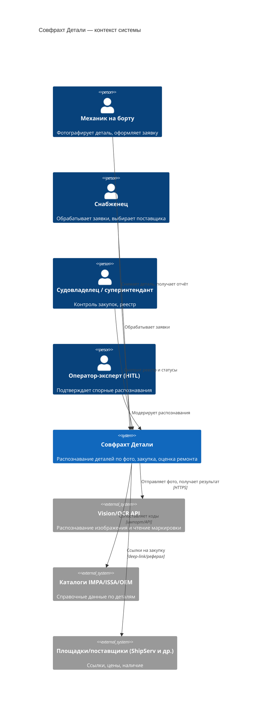
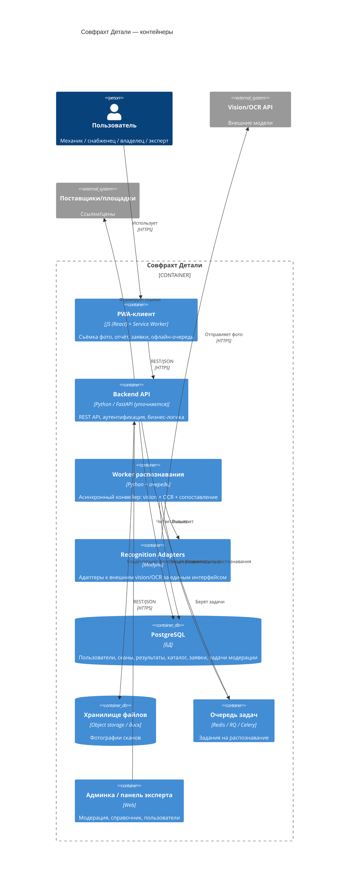
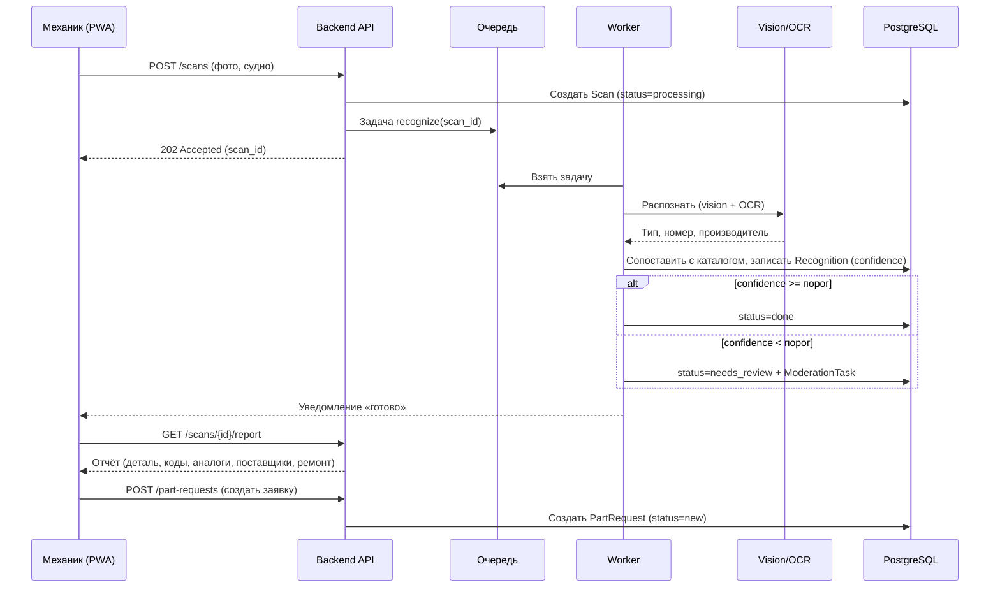
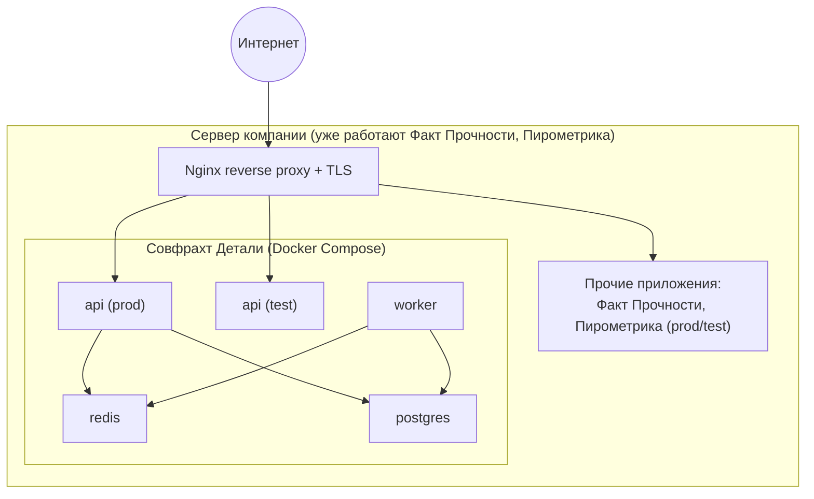

# 06 · Архитектура (C4) и развёртывание

Системная архитектура продукта **Совфрахт Детали** (`Sovfrasht_Parts`). Диаграммы в нотации C4 (уровни Context и Container) в формате Mermaid. Раздел развёртывания привязан к существующему серверу компании.

> **Статус стека: подтверждён заказчиком (31.07.2026).** Стек MVP: **Python/FastAPI + Celery/Redis + PostgreSQL + React/Vite (PWA) + Docker**, развёртывание рядом с «Факт Прочности» и «Пирометрикой» за существующим Nginx. Разделы «Стек» и «Развёртывание» ниже — целевые, не требуют дополнительного согласования.

## 1. Архитектурные принципы

Разделение фронтенда и бэкенда через REST API — чтобы MVP-PWA и будущий натив использовали один бэкенд. Доменная логика (распознавание-конвейер, правила ремонта, RBAC) вынесена из UI в сервисный слой (NFR-MAINT-01). Внешние модели (vision/OCR) изолированы за адаптерами — их можно заменить без переписывания ядра. Асинхронная обработка тяжёлых задач (распознавание) через очередь, чтобы не блокировать пользователя. Single-tenant, self-hosted на сервере компании; секреты — вне репозитория.

## 2. C4 уровень 1 — Context (окружение системы)

## 3. C4 уровень 2 — Container (внутренние контейнеры)

## 4. Поток «фото → отчёт → заявка» (последовательность)

## 5. Предлагаемый стек (подтвердить под инфраструктуру)

| Слой | Предложение | Комментарий |
|------|-------------|-------------|
| Клиент (MVP) | React + Vite, PWA (service worker), доступ к камере через Web API | Одна кодовая база, быстрый деплой без сторов |
| Клиент (цель) | Flutter или React Native | Натив для камеры/офлайн/пуш при масштабировании |
| Backend API | Python + FastAPI | Быстрая разработка, типизация, лёгкая интеграция с ML/HTTP |
| Async | Celery или RQ + Redis | Очередь задач распознавания |
| БД | PostgreSQL (+ pgvector) | Данные + векторный поиск по каталогу |
| Хранилище фото | Object storage (S3-совместимое) или диск сервера | Закрытый доступ, подписанные ссылки |
| Распознавание | Внешние vision/OCR API за адаптером | На MVP — готовые модели; позже своя |
| Контейнеризация | Docker + docker-compose | Рядом с существующими приложениями |
| Reverse proxy | Nginx (существующий) | Отдельный домен/путь + TLS |

> Стек подтверждён заказчиком: бэкенд на Python/FastAPI. Структура контейнеров зафиксирована.

## 6. Развёртывание на существующем сервере

Принципы деплоя (детали в NFR раздел 9): отдельные окружения прод/тест по образцу существующих приложений; маршрутизация через существующий Nginx по отдельному домену/пути; изоляция портов и ресурсов, чтобы не мешать соседним приложениям; секреты — в переменных окружения сервера, не в Git; возможность отката к предыдущему образу.

## 7. Ключевые архитектурные решения (ADR-кратко)

**Асинхронное распознавание через очередь.** Распознавание занимает секунды и зависит от внешних API — выносим в worker, чтобы API отвечал мгновенно (202) и пользователь не ждал в блокирующем запросе.

**Адаптеры для vision/OCR.** Внешние модели меняются и дорожают; изоляция за единым интерфейсом позволяет менять провайдера и позже подключить собственную модель без изменения ядра.

**Единый бэкенд для PWA и натива.** Вся логика — в API/сервисном слое; клиент тонкий. Это защищает инвестицию при переходе с PWA на натив.

**Single-tenant self-hosted.** Для внутреннего инструмента Совфрахта проще, безопаснее и дешевле, чем мультитенант-облако; данные не покидают периметр компании.
