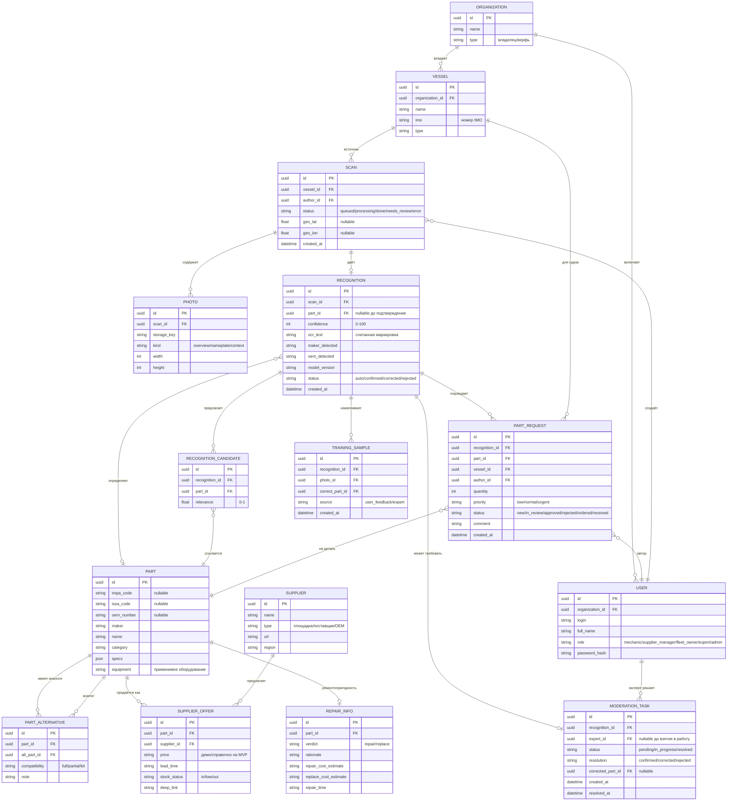

# 07 · Модель данных

Логическая модель данных продукта **Совфрахт Детали**. Диаграмма «сущность-связь» (Mermaid `erDiagram`) плюс описание сущностей и правил. Служит основой для схемы БД (PostgreSQL) и миграций.

## 1. ER-диаграмма

## 2. Описание ключевых сущностей

**Organization** — компания (Совфрахт как основной арендатор; в перспективе — внешние организации). Тип различает владельца флота и верфь.

**Vessel** — судно, с номером IMO. Механик привязан к судну; сканы и заявки относятся к судну.

**User** — пользователь с ролью (RBAC из NFR-SEC-03). Принадлежит организации.

**Scan** — единица распознавания: набор фото + метаданные. Проходит статусы `queued → processing → done | needs_review | error`.

**Photo** — отдельное фото скана с типом (общий вид / шильдик / место установки) и ключом в хранилище (доступ по подписанным ссылкам, NFR-SEC-04).

**Recognition** — результат распознавания скана: определённая деталь (или null до подтверждения), `confidence`, считанный OCR-текст, обнаруженные производитель/номер, версия модели, статус.

**RecognitionCandidate** — альтернативные кандидаты детали с релевантностью (реализует бизнес-правило «минимум один альтернативный вариант», NFR-ACC-02).

**Part** — позиция каталога: коды IMPA/ISSA/OEM, производитель, наименование, категория, характеристики (json), применимое оборудование. Хотя бы один из кодов/номеров заполнен.

**PartAlternative** — связь «деталь ↔ аналог» с признаком совместимости.

**Supplier / SupplierOffer** — поставщик/площадка и его предложение по детали (цена, срок, наличие, deep-link). На MVP цены справочные/курируемые.

**RepairInfo** — ремонтопригодность детали: вердикт (ремонт/замена), обоснование, оценки стоимости и срока.

**PartRequest** — заявка на снабжение из отчёта. Проходит статусы `new → in_review → approved | rejected → ordered → received`.

**ModerationTask** — задача HITL: создаётся при `confidence` ниже порога или вручную; эксперт подтверждает/исправляет/отклоняет.

**TrainingSample** — размеченный пример (из обратной связи пользователя или решения эксперта) для дообучения модели (FR-REC-06).

**VisionCache** *(добавлено на шаге 2 реализации)* — кэш ответов платных vision/OCR API. Ключ — пара «провайдер + sha256 изображения», плюс версия модели, тело ответа и счётчик попаданий. Нужен для NFR-COST-01: одно и то же фото не оплачивается дважды — ни при повторной отправке скана, ни при переобработке после сбоя. Записи старше `VISION_CACHE_TTL_DAYS` считаются промахом (модели обновляются). По счётчику попаданий видно, сколько платных вызовов сэкономлено.

**PartAlias** *(добавлено на шаге 3)* — альтернативное написание номера или наименования. Ищется точно, наравне с основным номером: поставщики пишут один и тот же номер по-разному, и это дешевле и надёжнее нечёткого поиска.

У **Part** на шаге 3 добавлены нормализованные коды `impa_code_norm`, `issa_code_norm`, `oem_number_norm`, `maker_norm` — канонические формы (верхний регистр, только A-Z0-9). Заполняются одинаково при импорте каталога и при поиске по строке из OCR, иначе точное совпадение промахивается на пробелах и дефисах.

У **Recognition** на шаге 3 добавлены `detected_tokens` (все номероподобные токены с шильдика и признак выбранного — сырьё для калибровки эвристики по реальным фото) и `catalog_status` (`matched` / `candidates` / `not_found`).

У **Recognition** на шаге 4 добавлены поля обратной связи (FR-REP-04): `feedback_verdict` (`confirm`/`reject`), `feedback_by`, `feedback_at`, `feedback_comment`.

У **Photo** на шаге 2 добавлены поля: `mime_type`, `size_bytes` и `content_sha256` — хеш содержимого служит ключом кэша выше и позволяет распознать повторную присылку того же изображения.

## 3. Правила целостности и данных

Каждый `Scan` принадлежит одному судну и одному автору; данные видны в пределах организации (RBAC). **Инвариант опознаваемости `Part`:** обязательны `name` И хотя бы одно из `maker` / `equipment` (CHECK `ck_parts_identifiable`, миграция `0005`). Жёсткое требование «минимум один код» снято миграцией `0004`: в стартовом каталоге 30 из 56 позиций (крупные судовые дизели Wärtsilä, MAN B&W) поставляются без публичных номеров и опознаются по `name` + `maker` + `equipment`. Коды `impa_code`/`issa_code`/`oem_number` желательны, но не обязательны; совсем неопознаваемых строк в каталоге быть не должно. `Recognition.part_id` может быть null до подтверждения; после подтверждения/исправления заполняется. `PartRequest` не создаётся автоматически при `confidence` ниже порога без подтверждения (FR-REC-04, NFR-ACC-03). Удаление пользователя не удаляет его сканы/заявки (историчность) — используется мягкое удаление/анонимизация. Все временные метки — в UTC; отображение — в часовом поясе пользователя.

## 4. Индексы и поиск (рекомендации для реализации)

Индексы по внешним ключам (`vessel_id`, `author_id`, `scan_id`, `part_id`) и по статусам (`Scan.status`, `PartRequest.status`, `ModerationTask.status`) для реестров и очередей. Полнотекстовый/триграммный индекс по `Part.name`, `oem_number`, кодам — для быстрого поиска. Векторный индекс (pgvector) по эмбеддингам описаний деталей — для нечёткого сопоставления результата распознавания с каталогом (FR-CAT-02).
