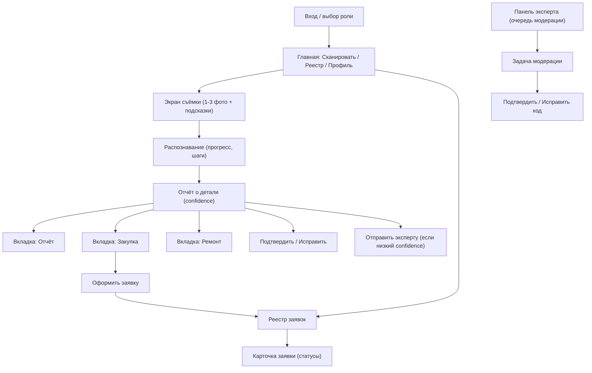

# 09 · Карта экранов и UX-потоки

Карта экранов MVP и основные пользовательские потоки продукта **Совфрахт Детали**. Ориентир по интерфейсу — интерактивный прототип (`Прототип/MarinePartID_Prototype.html`). Mobile-first, крупные зоны нажатия, работа одной рукой (NFR-COMPAT-02).

## 1. Карта экранов (навигация)

## 2. Экраны MVP (перечень и назначение)

**Вход / роль.** Авторизация; определяет доступные разделы по роли. (FR-AUTH-01/02)

**Главная.** Быстрый доступ к «Сканировать», «Реестр», «Профиль». Для механика акцент — большая кнопка съёмки; для снабженца/владельца — реестр заявок.

**Экран съёмки.** Видоискатель с рамкой и подсказками (снять шильдик), съёмка 1–3 фото или выбор из галереи, проверка качества. (FR-CAP-01/02/03)

**Распознавание.** Индикатор прогресса с этапами (зрение → OCR → каталог → поставщики) — управляет ожиданием пользователя. (FR-REC-01)

**Отчёт о детали.** Заголовок с деталью и оборудованием, индикатор `confidence`, три вкладки. При низком confidence — предупреждение и кнопка «отправить эксперту». (FR-REP-01/02)
- *Вкладка «Отчёт»*: идентификация (коды IMPA/ISSA/OEM, производитель), характеристики, аналоги. (FR-REP-01/03)
- *Вкладка «Закупка»*: поставщики, цены, сроки, наличие, ссылки; кнопка «Оформить заявку». (FR-PRO-01/02/03)
- *Вкладка «Ремонт»*: вердикт ремонт/замена, обоснование, сравнение стоимости/срока, дисклеймер. (FR-REPAIR-01/02)

**Подтверждение/исправление.** Кнопки «Верно/Неверно»; при «Неверно» — выбор правильной детали. (FR-REP-04)

**Оформление заявки.** Количество, приоритет, комментарий → создать. (FR-PRO-03)

**Реестр заявок.** Список с фильтрами (судно, статус, дата); карточка заявки со сменой статуса для уполномоченных ролей. (FR-REG-01/02)

**Профиль/настройки.** Пользователь, судно, язык, разрешения (камера, геопозиция).

**Панель эксперта (админ-веб).** Очередь задач модерации; карточка задачи с фото, предложенным результатом и кандидатами; действия подтвердить/исправить/отклонить. (FR-HITL-02/03)

## 3. Ключевой поток «фото → заявка» (счастливый путь)

Механик на главной жмёт «Сканировать» → снимает деталь и шильдик (подсказка помогает поймать номер) → видит прогресс распознавания → получает отчёт с confidence 94% → проверяет идентификацию, смотрит вкладку «Ремонт» (вердикт «замена») → на вкладке «Закупка» выбирает поставщика → «Оформить заявку» с количеством → заявка создана и попала в реестр, снабженец уведомлён.

## 4. Поток при низкой достоверности (HITL)

Распознавание вернуло confidence 55% → в отчёте предупреждение и кнопка «Отправить эксперту» → механик отправляет → создаётся задача модерации, показывается ожидаемый срок → эксперт в панели видит фото и кандидатов, подтверждает правильный код → механик получает уведомление с итоговым результатом → продолжает к закупке. Исправление эксперта сохраняется для дообучения.

## 5. Принципы UI (для реализации)

Каждый результат показывает достоверность и не выдаёт «единственно верный» ответ без альтернатив (бизнес-правило). Крупные кнопки и контрастная тема — под условия машинного отделения. Минимум ввода с клавиатуры (перчатки): выбор, а не набор, где возможно. Понятные статусы очереди при слабой связи («ожидает отправки», «распознаётся», «готово»). Русский интерфейс с готовностью к английскому (NFR-L10N-01). Прототип `MarinePartID_Prototype.html` — визуальный ориентир по компоновке экранов отчёта, закупки и ремонта.
